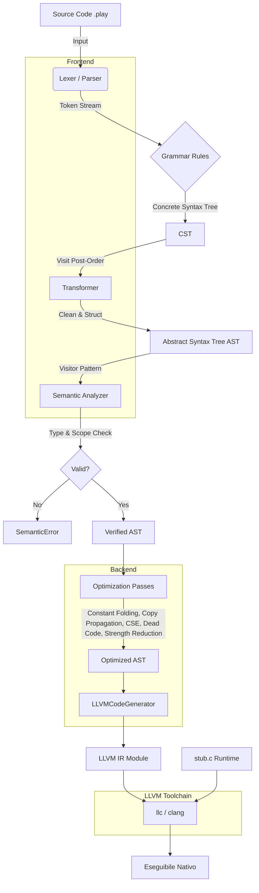
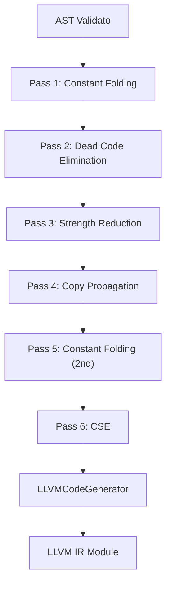

# Technical Report: Play Language Compiler

## 1. Mappa Dettagliata delle Funzionalità

Il progetto implementa un compilatore per il linguaggio "Play". Il suo compito è trasformare il codice sorgente in codice macchina eseguibile attraverso una pipeline di analisi lessicale, sintattica, semantica e generazione di codice LLVM IR.

### Componenti Chiave

#### 1. Lexer & Parser (`grammar.lark`)

* **Scopo:** Analisi Lessicale (tokenizzazione) e Sintattica (parsing).
* **Tecnologia:** Libreria **Lark** con algoritmo **LALR(1)** e lexer separato (`lexer='basic'`), veloce ed efficiente per grammatiche standard.
* **Dettagli Implementativi:**
  * **Priorità dei Token:** Le regole lessicali sono ordinate per priorità (longest match wins). Esempio: `PLAY: "play"` viene definito prima di `ID` per evitare che la parola chiave "play" venga scambiata per un identificatore variabile.
  * **Regex Specifiche:**
    * Interi (`INTEGER_CONST`): `/[0-9]+/`
    * Reali (`REAL_CONST`): `/[0-9]+\.[0-9]+/`
    * Stringhe (`STRING_CONST`): `/"[^"]*"/` (gestisce stringhe tra doppi apici).
  * **Gerarchia delle Espressioni:** La precedenza degli operatori è gestita tramite annidamento delle regole EBNF:
    * `logic_expr` (minima precedenza, es. `&&`, `||`)
    * `comp_expr` (es. `<`, `==`)
    * `sum_expr` (es. `+`, `-`)
    * `prod_expr` (massima precedenza, es. `*`, `/`)
    * L'uso del prefisso `?` (es. `?sum_expr`) in Lark indica di "appiattire" l'albero se il nodo ha un solo figlio, semplificando il CST.

#### 2. AST Definition (`ast_node.py`)

* **Scopo:** Strutture dati per la rappresentazione intermedia.
* **Gerarchia delle Classi:**
  * **`AstNode`**: Classe base astratta.
  * **`StmtNode`**: Per istruzioni che non ritornano valore (`AssignNode`, `IfNode`, `WhileNode`).
  * **`ExprNode`**: Per espressioni valutabili (`BinOpNode`, `LiteralNode`, `VarAccessNode`).


#### 3. CST to AST Transformer (`transformer.py`)

* **Scopo:** Pulizia e normalizzazione dell'albero di parsing.

* **Pattern:** **Tree Transformation** (Post-order traversal).

* **Logica Chiave:**
  
  * **Flattening:** Il parser Lark produce liste annidate per regole come `lvalue_list`. Il metodo `var_list` nel trasformatore "appiattisce" queste liste per renderle lineari e facili da processare.
  
  * **Handling Parentheses:** Le parentesi (`LPAR`, `RPAR`) sono puramente sintattiche. Il metodo `base_expr` le scarta, restituendo direttamente l'espressione contenuta (`items[1]`). Nell'AST, la struttura dell'albero definisce implicitamente l'ordine di valutazione, rendendo le parentesi obsolete.
  
  * **Chained Assignment:** Gestisce costrutti complessi come `rank: a = b <-- 10` creando nodi `VarInitNode` separati ma collegati logicamente.
  
  * **Snippet (`transformer.py`):**
    
    ```python
    # Esempio di gestione "Flattening" liste
    def var_list(self, items):
        full_list = []
        for item in items:
            if isinstance(item, list):
                full_list.extend(item)
        return full_list
    ```

#### 4. Semantic Analyzer (`semantic_analysis.py`)

* **Scopo:** Type Checking e Symbol Table.

* **Pattern:** **Visitor Pattern**. La classe `SemanticAnalyzer` ha un metodo `visit_NomeNodo(node)` per ogni tipo di nodo AST.

* **Gestione dello Scope:**
  
  * Usa una `SymbolTable` implementata come **stack di dizionari** (`self.scopes`).
  * `enter_scope()`: Push di un nuovo dizionario vuoto (es. entrando in una funzione).
  * `exit_scope()`: Pop del dizionario corrente.
  * `lookup(name)`: Cerca la variabile partendo dallo scope corrente risalendo fino al globale.

* **Type System & Promotion:**
  
  * Metodo `_check_type_compatibility(expected, actual)`.
  
  * Supporta la **conversione implicita** (Coercion) bidirezionale tra `rank` e `rate`: un valore `rank` (intero) è compatibile dove è atteso un `rate` (float) e viceversa (con troncamento).
  
  * Tipi supportati: `rank` (int), `rate` (float), `flag` (bool), `label` (string).
  
  * **Snippet (`semantic_analysis.py`):**
    
    ```python
    def _check_type_compatibility(self, expected, actual):
        if expected == actual:
            return True
        # Promotion: rank -> rate
        if expected == 'rate' and actual == 'rank':
            return True
        # Demotion: rate -> rank (con troncamento)
        if expected == 'rank' and actual == 'rate':
            return True
        return False
    ```

---

## 2. Architettura e Flusso dei Dati

Il compilatore segue una pipeline sequenziale:

### Il Viaggio del Codice

1. **Input (Source Code):**
   
   ```text
   rank: x <-- 10 + 5
   ```

2. **Lexical & Syntax Analysis (Lark):**
   
   * Input: Codice Play.
   * Output: **CST (Concrete Syntax Tree)**.
   * Token individuati: `RANK`, `ID(x)`, `ASSIGN`, `INTEGER(10)`, `PLUS`, `INTEGER(5)`.
   * L'albero contiene ancora la struttura "sporca" della grammatica, inclusi token inutili.

3. **AST Transformation (PlayTransformer):**
   
   * Input: CST.
   * Output: **AST (Abstract Syntax Tree)**.
   * L'operazione `10 + 5` viene convertita in un oggetto:
     
     ```python
     BinOpNode(
         left=LiteralNode(10, 'rank'),
         op='+',
         right=LiteralNode(5, 'rank')
     )
     ```
   
   * La dichiarazione + inizializzazione diventa: `VarDeclNode(type_name='rank', var_list=[VarInitNode(name='x', expr=BinOpNode(...))])`.

4. **Semantic Analysis (SemanticAnalyzer):**
   
   * Input: AST.
   * Output: AST Validato (o Eccezione).
   * **Passo 1:** Visita `VarDeclNode` di `x`. Inserisce `x: rank` nella Symbol Table corrente.
   * **Passo 2:** Visita `AssignNode`.
     * Cerca `x` nella Symbol Table -> Trovato, tipo `rank`.
     * Visita `BinOpNode`: Controlla che `+` supporti `rank` e `rank` -> Sì, risultato `rank`.
     * Controlla compatibilità assegnamento: Destinazione `rank` == Sorgente `rank` -> OK.

### Diagramma di Flusso (Pipeline)



---

## 3. Backend: Generazione Codice LLVM

Il backend trasforma l'AST validato in **codice LLVM IR eseguibile**. Questa sezione documenta l'architettura del generatore di codice e le ottimizzazioni implementate.

### 3.1 Architettura del Code Generator

Il backend è implementato in `src/play_lang/backend/codegen.py` usando il pattern **Visitor** (identico al semantic analyzer).

#### Componenti Chiave

**Classe:** `LLVMCodeGenerator`

**Libreria:** `llvmlite` - Binding Python per generare LLVM IR

**Responsabilità:**

1. **Traduzione AST → LLVM IR**: Ogni nodo AST viene tradotto in istruzioni LLVM equivalenti
2. **Gestione Symbol Table**: Traccia variabili locali e globali con i loro puntatori LLVM
3. **Type Mapping**: Converte i tipi Play in tipi LLVM
4. **Scope Management**: Gestisce scope annidati (globale, funzione, blocchi)
5. **Interfaccia con Runtime C**: Integra funzioni C per I/O (`printf`, `scanf`, `sprintf`)

#### Struttura Dati Interna

```python
class LLVMCodeGenerator:
    def __init__(self, module_name="play_module"):
        # Modulo LLVM (container per tutte le funzioni/variabili)
        self.module = ir.Module(name=module_name)

        # Builder: genera istruzioni nel blocco corrente
        # Inizializzato a None, viene creato quando si entra in una funzione
        self.builder = None

        # Funzione corrente in compilazione
        self.current_function = None

        # Stack di scope: [{nome_var: (ptr, tipo_play)}]
        # Scope[0] = globale, Scope[-1] = più locale
        self.scope_stack = [{}]

        # Stack di exit blocks per gestire break/quit nei loop
        self.loop_exit_stack = []

        # Dimensione del buffer per le stringhe (label)
        self.STRING_BUFFER_SIZE = 256

        # Flag per tracciare se siamo in un contesto drop
        # (per validare l'operatore -->)
        self.in_drop_context = False

        # Definizione delle funzioni di libreria C esterne
        self._declare_external_functions()
```

### 3.2 Mapping Tipi Play → LLVM

| Tipo Play | Tipo LLVM | Descrizione                         |
| --------- | --------- | ----------------------------------- |
| `rank`    | `i32`     | Intero a 32 bit con segno           |
| `rate`    | `double`  | Float a 64 bit (IEEE 754)           |
| `flag`    | `i1`      | Booleano (1 bit)                    |
| `label`   | `i8*`     | Puntatore a stringa (char*)         |
| `void`    | `void`    | Nessun valore di ritorno (funzioni) |

**Dettaglio Implementazione (`_get_llvm_type`):**

```python
def _get_llvm_type(self, play_type):
    type_mapping = {
        'rank': ir.IntType(32),           # int32
        'rate': ir.DoubleType(),          # double
        'flag': ir.IntType(1),            # bool
        'label': ir.IntType(8).as_pointer(),  # char*
        'void': ir.VoidType()
    }
    return type_mapping[play_type]
```

### 3.3 Cast Automatici tra Tipi

Il generatore supporta **conversioni implicite** tra tipi compatibili (consistente con il semantic analyzer).

#### Matrice di Conversioni Supportate

| From → To | rank     | rate          | flag          |
| --------- | -------- | ------------- | ------------- |
| **rank**  | -        | `sitofp`      | `icmp != 0`   |
| **rate**  | `fptosi` | -             | `fcmp != 0.0` |
| **flag**  | `zext`   | `zext+sitofp` | -             |

**Esempio di Cast (`_cast_value`):**

```python
# rank -> rate: int to double
if from_type == 'rank' and to_type == 'rate':
    return self.builder.sitofp(value, ir.DoubleType())

# rate -> rank: double to int (con troncamento)
if from_type == 'rate' and to_type == 'rank':
    return self.builder.fptosi(value, ir.IntType(32))
```

### 3.4 Gestione Variabili

#### Variabili Globali

**Problema:** Le variabili dichiarate a livello globale in Play devono essere accessibili da tutte le funzioni.

**Soluzione:** Usare `ir.GlobalVariable` del modulo LLVM.

**Codice Play:**

```play
rank: global_counter <-- 0
```

**LLVM IR Generato:**

```llvm
@global_counter = internal global i32 0
```

**Implementazione:**

```python
def visit_VarDeclNode(self, node):
    is_global_scope = (self.builder is None or self.current_function is None)

    if is_global_scope:
        # Crea GlobalVariable con initializer costante
        global_var = ir.GlobalVariable(
            self.module, 
            llvm_type, 
            name=var_name
        )
        global_var.initializer = ir.Constant(llvm_type, 0)
        global_var.linkage = 'internal'

        # Registra nello scope globale (primo nello stack)
        self.scope_stack[0][var_name] = (global_var, node.type_name)
```

#### Variabili Locali

**Soluzione:** Allocare sullo stack della funzione usando `alloca`.

**Codice Play:**

```play
action calculate() {
    rank: x <-- 10
}
```

**LLVM IR Generato:**

```llvm
define void @calculate() {
entry:
  %x = alloca i32
  store i32 10, i32* %x
  ...
}
```

**Implementazione:**

```python
else:  # Scope locale
    with self.builder.goto_entry_block():
        var_ptr = self.builder.alloca(llvm_type, name=var_name)

    # Registra nello scope corrente (ultimo nello stack)
    self.scope_stack[-1][var_name] = (var_ptr, node.type_name)
```

**Nota:** `goto_entry_block()` viene usato per le variabili locali dichiarate nel corpo di una funzione, in modo che l'`alloca` venga emessa nel blocco `entry` (requisito LLVM per le allocazioni stack). Per i **parametri** delle funzioni (in `visit_FunNode`), `goto_entry_block()` non è necessario perché ci troviamo già nel blocco `entry` appena creato.

#### Gestione Stringhe (label)

**Problema:** Le stringhe in Play sono mutabili (possono essere ri-assegnate). Un semplice `i8*` punterebbe a stringhe costanti in read-only memory.

**Soluzione:** Allocare un **buffer scrivibile** di 256 byte sullo stack per ogni variabile `label`.

**Codice Play:**

```play
label: message <-- "Hello"
message <-- "World"  // Deve sovrascrivere il buffer
```

**LLVM IR Generato:**

```llvm
%message.buffer = alloca [256 x i8]
%message = bitcast [256 x i8]* %message.buffer to i8*
```

**Implementazione:**

```python
if node.type_name == 'label':
    # Alloca array di 256 char
    buffer_type = ir.ArrayType(ir.IntType(8), 256)
    buffer_ptr = self.builder.alloca(buffer_type)

    # Bitcast a i8* per compatibilità con printf/scanf
    var_ptr = self.builder.bitcast(buffer_ptr, ir.IntType(8).as_pointer())
```

**Operazione di Copia Stringhe:**

Per assegnare una stringa, non possiamo fare `store` diretto (sovrascriveremmo il puntatore). Implementiamo una **copia carattere per carattere** tramite un loop LLVM:

```python
def _copy_string_to_buffer(self, source_ptr, dest_buffer_ptr, max_size):
    current_func = self.builder.block.function

    # Crea i blocchi per il loop di copia
    loop_cond = current_func.append_basic_block(name="strcpy.cond")
    loop_body = current_func.append_basic_block(name="strcpy.body")
    loop_end = current_func.append_basic_block(name="strcpy.end")

    # Alloca un contatore per l'indice
    index_ptr = self.builder.alloca(ir.IntType(32), name="strcpy.index")
    self.builder.store(ir.Constant(ir.IntType(32), 0), index_ptr)
    self.builder.branch(loop_cond)

    # Blocco condizione: controlla null terminator o limite buffer
    self.builder.position_at_end(loop_cond)
    index = self.builder.load(index_ptr)
    max_index = ir.Constant(ir.IntType(32), max_size - 1)
    at_limit = self.builder.icmp_signed('>=', index, max_index)
    src_char_ptr = self.builder.gep(source_ptr, [index])
    src_char = self.builder.load(src_char_ptr)
    is_null = self.builder.icmp_signed('==', src_char, ir.Constant(ir.IntType(8), 0))
    should_stop = self.builder.or_(at_limit, is_null)
    self.builder.cbranch(should_stop, loop_end, loop_body)

    # Blocco body: copia il carattere e incrementa indice
    self.builder.position_at_end(loop_body)
    # ... carica carattere, memorizza nel buffer, incrementa indice ...
    self.builder.branch(loop_cond)

    # Blocco end: aggiungi null terminator
    self.builder.position_at_end(loop_end)
    final_index = self.builder.load(index_ptr)
    dest_null_ptr = self.builder.gep(dest_buffer_ptr, [final_index])
    self.builder.store(ir.Constant(ir.IntType(8), 0), dest_null_ptr)
```

### 3.5 Funzioni Utente

#### Definizione Funzione

**Codice Play:**

```play
action calculate_area(rate radius) -> rate {
    reward radius * radius * 3.14
}
```

**LLVM IR Generato:**

```llvm
define double @calculate_area(double %radius) {
entry:
  %radius.ptr = alloca double
  store double %radius, double* %radius.ptr
  %0 = load double, double* %radius.ptr
  %1 = load double, double* %radius.ptr
  %2 = fmul double %0, %1
  %3 = fmul double %2, 3.14
  ret double %3
}
```

**Implementazione:**

```python
def visit_FunNode(self, node):
    # 1. Crea firma funzione
    ret_llvm_type = self._get_llvm_type(node.ret_type)
    param_types = [self._get_llvm_type(p.type_name) for p in node.params]
    func_type = ir.FunctionType(ret_llvm_type, param_types)

    # 2. Crea funzione nel modulo
    func = ir.Function(self.module, func_type, name=node.name)

    # 3. Salva stato corrente (per ripristinare dopo)
    old_builder = self.builder
    old_function = self.current_function

    # 4. Imposta funzione corrente e push nuovo scope
    self.current_function = func
    self.scope_stack.append({})

    # 5. Crea entry block e nuovo builder
    entry_block = func.append_basic_block(name="entry")
    self.builder = ir.IRBuilder(entry_block)

    # 6. Alloca parametri sullo stack (per renderli mutabili)
    for i, (param_val, param_node) in enumerate(zip(func.args, node.params)):
        param_val.name = param_node.name  # Nome argomento LLVM
        param_ptr = self.builder.alloca(param_val.type, name=f"{param_node.name}.addr")
        self.builder.store(param_val, param_ptr)
        self.scope_stack[-1][param_node.name] = (param_ptr, param_node.type_name)

    # 7. Visita il corpo della funzione (body è un BlockNode)
    self.visit(node.body)

    # 8. Aggiunge return di default se mancante (tipo-specifico)
    if not self.builder.block.is_terminated:
        if node.ret_type == 'void':
            self.builder.ret_void()
        elif node.ret_type == 'rank':
            self.builder.ret(ir.Constant(ir.IntType(32), 0))
        elif node.ret_type == 'rate':
            self.builder.ret(ir.Constant(ir.DoubleType(), 0.0))
        elif node.ret_type == 'flag':
            self.builder.ret(ir.Constant(ir.IntType(1), 0))
        elif node.ret_type == 'label':
            self.builder.ret(ir.Constant(ir.IntType(8).as_pointer(), None))

    # 9. Pop scope e ripristina stato
    self.scope_stack.pop()
    self.builder = old_builder
    self.current_function = old_function
```

#### Return Statement (reward)

**Codice Play:**

```play
reward x + y
```

**LLVM IR:**

```llvm
%result = add i32 %x, %y
ret i32 %result
```

**Implementazione:**

```python
def visit_ReturnNode(self, node):
    if node.expr:
        ret_value = self.visit(node.expr)
        self.builder.ret(ret_value)
    else:
        self.builder.ret_void()
```

#### Chiamate a Funzione: Statement vs Espressione

Il compilatore distingue tra due tipi di chiamata a funzione:

| Tipo            | Nodo AST           | Uso           | Valore di ritorno |
| --------------- | ------------------ | ------------- | ----------------- |
| **Statement**   | `FuncCallStmtNode` | `foo()`       | Ignorato          |
| **Espressione** | `FunCallExprNode`  | `x <-- foo()` | Utilizzato        |

**FuncCallStmtNode** — Chiamata come statement autonomo:

```python
def visit_FuncCallStmtNode(self, node):
    # Cerca la funzione, valuta argomenti, effettua cast
    # ...
    # Chiama la funzione (ignora il valore di ritorno)
    self.builder.call(func, casted_args)
```

**FuncCallExprNode** — Chiamata come espressione (il valore viene usato):

```python
def visit_FunCallExprNode(self, node):
    # Cerca la funzione, valuta argomenti, effettua cast
    # ...
    # Chiama la funzione e restituisce il risultato
    return self.builder.call(func, casted_args)
```

**Esempio Play:**

```play
// Statement: il valore di ritorno viene ignorato
stampa_messaggio()

// Espressione: il valore di ritorno viene assegnato
rank: area <-- calculate_area(5.0)
```

### 3.6 Strutture di Controllo

#### If-Else (choice/fail)

**Codice Play:**

```play
choice (x > 0) -> {
    drop "Positive"
} fail -> {
    drop "Non-positive"
}
```

**LLVM IR (Schema):**

```llvm
entry:
  %cond = icmp sgt i32 %x, 0
  br i1 %cond, label %then, label %else

then:
  call i32 @printf(...)
  br label %merge

else:
  call i32 @printf(...)
  br label %merge

merge:
  ; continua...
```

**Implementazione:**

```python
def visit_IfNode(self, node):
    condition = self.visit(node.condition)

    # Cast implicito a flag (bool) se necessario
    cond_type = self._get_play_type_from_llvm(condition.type)
    if cond_type != 'flag':
        condition = self._cast_value(condition, cond_type, 'flag')

    current_func = self.builder.block.function

    then_block = current_func.append_basic_block("if.then")
    merge_block = current_func.append_basic_block("if.merge")

    # Se ci sono elif o else, crea blocco else
    if node.elifs or node.else_block:
        else_block = current_func.append_basic_block("if.else")
        self.builder.cbranch(condition, then_block, else_block)
    else:
        self.builder.cbranch(condition, then_block, merge_block)

    # Compila then block
    self.builder.position_at_end(then_block)
    self.visit(node.then_block)
    if not self.builder.block.is_terminated:
        self.builder.branch(merge_block)

    # Gestisci elif ed else (catena di branch annidati)
    if node.elifs or node.else_block:
        self.builder.position_at_end(else_block)
        for elif_node in (node.elifs or []):
            elif_cond = self.visit(elif_node.condition)
            elif_cond_type = self._get_play_type_from_llvm(elif_cond.type)
            if elif_cond_type != 'flag':
                elif_cond = self._cast_value(elif_cond, elif_cond_type, 'flag')
            elif_then = current_func.append_basic_block("elif.then")
            elif_else = current_func.append_basic_block("elif.else")
            self.builder.cbranch(elif_cond, elif_then, elif_else)

            self.builder.position_at_end(elif_then)
            self.visit(elif_node.block)
            if not self.builder.block.is_terminated:
                self.builder.branch(merge_block)

            self.builder.position_at_end(elif_else)

        if node.else_block:
            self.visit(node.else_block)
        if not self.builder.block.is_terminated:
            self.builder.branch(merge_block)

    self.builder.position_at_end(merge_block)
```

#### Elif (catena di condizioni)

Play supporta catene di condizioni tramite `retry`, che nel backend vengono tradotte come **if annidati** con blocchi LLVM separati.

**Codice Play:**

```play
choice (x > 10) -> {
    drop "Grande"
} retry (x > 0) -> {
    drop "Positivo"
} retry (x == 0) -> {
    drop "Zero"
} fail -> {
    drop "Negativo"
}
```

**Schema LLVM IR:**

```llvm
if.then:               ; x > 10
  call @printf("Grande")
  br label %if.merge

if.else:
  %elif1 = icmp sgt i32 %x, 0
  br i1 %elif1, label %elif.then, label %elif.else

elif.then:             ; x > 0
  call @printf("Positivo")
  br label %if.merge

elif.else:
  %elif2 = icmp eq i32 %x, 0
  br i1 %elif2, label %elif.then.1, label %elif.else.1

elif.then.1:           ; x == 0
  call @printf("Zero")
  br label %if.merge

elif.else.1:           ; fail (else)
  call @printf("Negativo")
  br label %if.merge

if.merge:
  ; continua...
```

**Nota:** Ogni `elif` genera una coppia di blocchi (`elif.then` + `elif.else`), creando una catena di branch condizionali che converge nel blocco `if.merge` finale.

#### While Loop (stay)

**Codice Play:**

```play
stay (i < 10) -> {
    i <-- i + 1
}
```

**LLVM IR (Schema):**

```llvm
while.cond:
  %i = load i32, i32* %i.ptr
  %cond = icmp slt i32 %i, 10
  br i1 %cond, label %while.body, label %while.after

while.body:
  %i.val = load i32, i32* %i.ptr
  %next = add i32 %i.val, 1
  store i32 %next, i32* %i.ptr
  br label %while.cond

while.after:
  ; continua...
```

#### For Loop (loop)

**Codice Play:**

```play
loop (i <-- 0; i < 10; i <-- i + 1) -> {
    drop i
}
```

**Strategia:** Tradurre in una struttura equivalente a while:

1. **init**: Eseguito nel blocco corrente prima del loop
2. **for.cond**: Controlla condizione
3. **for.body**: Corpo del loop
4. **for.update**: Update counter
5. **for.after**: Esce dal loop

#### Break (quit)

La keyword `quit` permette di uscire anticipatamente da un loop. Il backend gestisce questa funzionalità tramite uno **stack di exit blocks** (`loop_exit_stack`).

**Codice Play:**

```play
loop (i <-- 1; i <= 100; i <-- i + 1) -> {
    choice (i % 7 == 0) -> {
        drop "Trovato: " + -->i
        quit
    }
}
```

**Meccanismo Backend:**

1. All'ingresso di ogni loop, il blocco di uscita (es. `while.after` o `for.after`) viene pushato su `loop_exit_stack`
2. Quando si incontra `quit`, il builder genera un branch incondizionato verso `loop_exit_stack[-1]`
3. All'uscita dal loop, il blocco viene poppato dallo stack

**Implementazione:**

```python
def visit_BreakNode(self, node):
    if not self.loop_exit_stack:
        raise RuntimeError("Break/Quit usato fuori da un loop")

    # Salta al blocco di uscita del loop più interno
    exit_block = self.loop_exit_stack[-1]
    self.builder.branch(exit_block)
```

**Supporto per loop annidati:** Lo stack gestisce naturalmente i loop annidati — `quit` esce sempre dal loop più interno.

**Nota:** La validazione di `quit` avviene su due livelli: il **Semantic Analyzer** usa un contatore `loop_depth` (gestito da `_enter_loop()` e `_exit_loop()`) che imposta il flag `in_loop` a `True` quando si entra in un loop e a `False` quando `loop_depth` torna a 0, supportando così i loop annidati. Il **Code Generator** usa `loop_exit_stack` per generare il branch LLVM corretto.

### 3.7 Operatore di Conversione a Stringa (-->)

Il linguaggio Play introduce un **operatore speciale `-->`** per la conversione esplicita di valori in stringhe all'interno del comando `drop`.

#### Regole di Utilizzo

**Quando è richiesto `-->`:**

1. **Variabili**: Tutte le variabili (di qualsiasi tipo) richiedono `-->` quando usate in `drop`
   
   ```play
   rank: x <-- 42
   drop -->x  // CORRETTO
   drop x     // ERRORE
   ```

2. **Espressioni**: Qualsiasi espressione (aritmetica, logica, di confronto) richiede `-->`
   
   ```play
   drop -->(x + y)     // CORRETTO
   drop -->(a > 5)     // CORRETTO
   drop x + y          // ERRORE
   ```

**Quando NON è richiesto `-->`:**

1. **Letterali**: I valori letterali (stringhe, numeri, booleani) possono essere usati direttamente
   
   ```play
   drop "Hello"   // CORRETTO
   drop 42        // CORRETTO  
   drop true      // CORRETTO
   ```

2. **Concatenazioni di letterali**: Combinazioni di letterali non richiedono `-->`
   
   ```play
   drop "Hello " + "World"  // CORRETTO
   ```

**Concatenazioni miste**: Quando si concatenano letterali e variabili/espressioni

```play
rank: num <-- 10
drop "Numero: " + -->num                    // CORRETTO
drop "Somma: " + -->(num + 5)              // CORRETTO
drop "a=" + -->a + " b=" + -->b            // CORRETTO
```

#### Implementazione

**Validazione del Contesto:**

Il compilatore mantiene un flag per garantire che `-->` sia usato solo all'interno di `drop`:

* **Semantic Analyzer** (`semantic_analysis.py`): usa `self.in_output` per validazione semantica
* **Code Generator** (`codegen.py`): usa `self.in_drop_context` per la generazione codice

```python
# Semantic Analyzer
def visit_OutputNode(self, node):
    self.in_output = True
    expr_type = self.visit(node.expr)
    self.in_output = False

# Code Generator (usa try/finally per sicurezza)
def visit_OutputNode(self, node):
    old_drop_context = self.in_drop_context
    self.in_drop_context = True
    try:
        value = self.visit(node.expr)
        # ... conversione e stampa ...
    finally:
        self.in_drop_context = old_drop_context
```

**Conversione in Stringa (`visit_UnaryOpNode`):**

L'operatore `-->` è implementato come operatore unario che converte il valore in stringa usando `sprintf`:

```python
if node.op == '-->':
    # Validazione: --> può essere usato solo in drop
    if not self.in_drop_context:
        raise RuntimeError(
            "L'operatore '-->' può essere usato solo all'interno di 'drop'"
        )

    # Se è già una stringa, ritorna così com'è
    if expr_type == 'label':
        return expr

    # Alloca buffer per la stringa risultante (256 byte)
    buffer_type = ir.ArrayType(ir.IntType(8), 256)
    buffer_ptr = self.builder.alloca(buffer_type)
    str_ptr = self.builder.bitcast(buffer_ptr, ir.IntType(8).as_pointer())

    # Converti in base al tipo
    if expr_type == 'rank':
        fmt = self._create_global_string("%d")
        self.builder.call(self.sprintf, [str_ptr, fmt, expr])
    elif expr_type == 'rate':
        fmt = self._create_global_string("%f")
        self.builder.call(self.sprintf, [str_ptr, fmt, expr])
    elif expr_type == 'flag':
        # Usa conversione speciale per booleani
        return self._convert_bool_to_string(expr)

    return str_ptr
```

#### Conversione Booleani

I valori `flag` (booleani) vengono convertiti nelle stringhe letterali `"true"` o `"false"` invece di `"1"` o `"0"`.

**Implementazione (`_convert_bool_to_string`):**

```python
def _convert_bool_to_string(self, bool_value):
    # Crea stringhe globali
    true_str = self._create_global_string("true")
    false_str = self._create_global_string("false")

    # Crea blocchi if-then-else
    then_block = current_func.append_basic_block("bool.true")
    else_block = current_func.append_basic_block("bool.false")
    merge_block = current_func.append_basic_block("bool.merge")

    # Alloca spazio per il risultato
    result_ptr = self.builder.alloca(ir.IntType(8).as_pointer())

    # Branch condizionale basato sul valore booleano
    self.builder.cbranch(bool_value, then_block, else_block)

    # Se true, memorizza puntatore a "true"
    self.builder.position_at_end(then_block)
    self.builder.store(true_str, result_ptr)
    self.builder.branch(merge_block)

    # Se false, memorizza puntatore a "false"
    self.builder.position_at_end(else_block)
    self.builder.store(false_str, result_ptr)
    self.builder.branch(merge_block)

    # Carica e restituisci il risultato
    self.builder.position_at_end(merge_block)
    return self.builder.load(result_ptr)
```

**Esempio Completo:**

```play
flag: condizione <-- true
rank: numero <-- 42

drop "Risultato: " + -->condizione  // Output: "Risultato: true"
drop "Numero: " + -->numero         // Output: "Numero: 42"
drop -->(5 > 3)                      // Output: "true"
```

### 3.8 Input/Output

#### Output (drop)

Il comando `drop` stampa un valore a schermo. Le variabili e le espressioni richiedono l'operatore `-->` per la conversione a stringa.

**Codice Play:**

```play
rank: x <-- 42
drop "Value: " + -->x
```

**LLVM IR:**

```llvm
; Conversione x in stringa via sprintf
%buf = alloca [256 x i8]
%str = bitcast [256 x i8]* %buf to i8*
call i32 @sprintf(i8* %str, i8* getelementptr(... "%d"), i32 %x)
; Concatenazione e stampa
call i32 @printf(i8* getelementptr(... "%s\n"), i8* %result)
```

**Implementazione:**

Il `visit_OutputNode` usa un pattern `try/finally` per gestire il contesto drop, e **converte automaticamente** tutti i tipi non-label in stringa prima di stampare:

```python
def visit_OutputNode(self, node):
    # Attiva contesto drop (abilita operatore -->)
    old_drop_context = self.in_drop_context
    self.in_drop_context = True

    try:
        value = self.visit(node.expr)
        value_type = self._get_play_type_from_llvm(value.type)

        # Se non è già una stringa, converti automaticamente
        if value_type != 'label':
            if value_type == 'rank':
                # Alloca buffer per la stringa risultante
                buffer_type = ir.ArrayType(ir.IntType(8), self.STRING_BUFFER_SIZE)
                buffer_ptr = self.builder.alloca(buffer_type, name="literal_to_string.buffer")
                str_ptr = self.builder.bitcast(buffer_ptr, ir.IntType(8).as_pointer(), name="literal_to_string")
                fmt = self._create_global_string("%d")
                self.builder.call(self.sprintf, [str_ptr, fmt, value])
                value = str_ptr
            elif value_type == 'rate':
                buffer_type = ir.ArrayType(ir.IntType(8), self.STRING_BUFFER_SIZE)
                buffer_ptr = self.builder.alloca(buffer_type, name="literal_to_string.buffer")
                str_ptr = self.builder.bitcast(buffer_ptr, ir.IntType(8).as_pointer(), name="literal_to_string")
                fmt = self._create_global_string("%f")
                self.builder.call(self.sprintf, [str_ptr, fmt, value])
                value = str_ptr
            elif value_type == 'flag':
                value = self._convert_bool_to_string(value)

        # Stampa SEMPRE come stringa con "%s\n"
        fmt = self._create_global_string("%s\n")
        self.builder.call(self.printf, [fmt, value])
    finally:
        self.in_drop_context = old_drop_context
```

**Nota:** Il formato è sempre `"%s\n"` — tutti i valori vengono prima convertiti in stringa attraverso `sprintf` o `_convert_bool_to_string`, poi stampati uniformemente.

#### Input (grab)

**Codice Play:**

```play
x <-- grab "Enter number: "
```

**LLVM IR:**

```llvm
call i32 @printf(i8* getelementptr(...))
call i32 @scanf(i8* getelementptr(...), i32* %x)
```

### 3.9 Ottimizzazioni AST

Il backend include **6 optimization passes** che operano sull'AST **prima** della generazione LLVM IR. L'ordine dei passes è intenzionale: ogni pass prepara il terreno per quelli successivi.

#### 1. Constant Folding

**Obiettivo:** Pre-calcolare espressioni costanti a compile-time.

**File:** `src/play_lang/backend/optimization/constant_folding.py`

**Esempio:**

```play
rank: x <-- 10 + 20 * 2
```

**Senza ottimizzazione:**

```llvm
%0 = mul i32 20, 2        ; = 40
%1 = add i32 10, %0       ; = 50
store i32 %1, i32* %x
```

**Con constant folding (sull'AST):**

L'AST viene trasformato:

```python
# Prima
BinOpNode(left=10, op='+', right=BinOpNode(20, '*', 2))

# Dopo
LiteralNode(value=50, type_tag='rank')
```

**LLVM IR risultante:**

```llvm
store i32 50, i32* %x
```

**Implementazione:**

```python
def visit_BinOpNode(self, node):
    # Visita ricorsivamente i sotto-alberi
    node.left = self.visit(node.left)
    node.right = self.visit(node.right)

    # Se entrambi sono letterali, calcola a compile-time
    if not (isinstance(node.left, LiteralNode) and isinstance(node.right, LiteralNode)):
        return node

    l_val, r_val = node.left.value, node.right.value
    l_type, r_type = node.left.type_tag, node.right.type_tag

    # Gestisce ogni operatore esplicitamente
    if node.op == '+':
        self.optimizations_count += 1
        if 'label' in [l_type, r_type]:
            return LiteralNode(str(l_val) + str(r_val), 'label')
        result_type = 'rate' if 'rate' in [l_type, r_type] else 'rank'
        return LiteralNode(l_val + r_val, result_type)
    elif node.op == '-':
        self.optimizations_count += 1
        result_type = 'rate' if 'rate' in [l_type, r_type] else 'rank'
        return LiteralNode(l_val - r_val, result_type)
    # ... analogamente per *, /, %, <, <=, >, >=, ==, <>, &&, ||

    return node
```

#### 2. Dead Code Elimination

**Obiettivo:** Rimuovere codice irraggiungibile e costrutti con condizioni costanti.

**File:** `src/play_lang/backend/optimization/dead_code.py`

**Strategie implementate:**

1. **Codice dopo return/break:** Tutto il codice dopo un `reward` o `quit` nello stesso blocco viene eliminato.
2. **If con condizione costante `true`:** L'intero `choice` viene sostituito con il solo `then_block`.
3. **If con condizione costante `false`:** L'intero `choice` viene sostituito con il blocco `fail` (else), o eliminato se assente. Se ci sono `retry` (elif), vengono valutati a catena.
4. **While con condizione costante `false`:** L'intero `stay` viene eliminato (sostituito con blocco vuoto).
5. **For con condizione costante `false`:** L'intero `loop` viene eliminato, mantenendo solo l'inizializzazione se presente.

**Esempio 1 — Codice dopo return:**

```play
action test() {
    reward 10
    drop "Never executed"  // DEAD CODE → rimosso
}
```

**Esempio 2 — If con condizione costante:**

```play
// Prima dell'ottimizzazione:
choice (false) -> { drop "mai" } fail -> { drop "sempre" }

// Dopo: solo il blocco else sopravvive
drop "sempre"
```

#### 3. Strength Reduction

**Obiettivo:** Sostituire operazioni con identità algebriche più efficienti.

**File:** `src/play_lang/backend/optimization/strength_reduction.py`

**Riduzioni implementate:**

| Pattern                        | Risultato | Tipo                                                     |
| ------------------------------ | --------- | -------------------------------------------------------- |
| `x * 0`, `0 * x`               | `0`       | Identità moltiplicativa                                  |
| `x * 1`, `1 * x`               | `x`       | Identità                                                 |
| `x * 2`, `2 * x`               | `x + x`   | Sostituzione con addizione (solo se `x` non è letterale) |
| `x + 0`, `0 + x`               | `x`       | Identità additiva                                        |
| `x - 0`                        | `x`       | Identità                                                 |
| `0 - x`                        | `-x`      | Negazione                                                |
| `x / 1`                        | `x`       | Identità                                                 |
| `true && x`, `x && true`       | `x`       | Short-circuit logico                                     |
| `false && x`, `x && false`     | `false`   | Short-circuit logico                                     |
| `false \|\| x`, `x \|\| false` | `x`       | Short-circuit logico                                     |
| `true \|\| x`, `x \|\| true`   | `true`    | Short-circuit logico                                     |

**Esempio:**

```play
rank: a <-- y * 2
rank: b <-- x + 0
rank: c <-- z * 1
```

**AST trasformato:**

```play
rank: a <-- y + y    // x * 2 → x + x
rank: b <-- x        // x + 0 → x
rank: c <-- z        // z * 1 → z
```

**Nota:** La riduzione `x * 2 → x + x` viene applicata solo quando `x` non è un letterale (altrimenti Constant Folding la gestirebbe).

#### 4. Copy Propagation

**Obiettivo:** Sostituire variabili copiate con il valore originale.

**File:** `src/play_lang/backend/optimization/copy_propagation.py`

**Esempio:**

```play
rank: x <-- 10
rank: y <-- x
drop -->y
```

**AST trasformato:**

```play
rank: x <-- 10
rank: y <-- x    // y è copia di x
drop -->x         // y sostituito con x (la sorgente della copia)
```

**Beneficio:** Riduce load/store ridondanti nel codice LLVM e prepara il terreno per il secondo pass di Constant Folding, che potrà ulteriormente semplificare le espressioni diventate costanti.

#### 5. Constant Folding (Secondo Pass)

**Obiettivo:** Ricalcolare espressioni diventate costanti dopo la Copy Propagation.

**Motivazione:** La Copy Propagation sostituisce variabili con i loro valori. Questo può creare nuove espressioni interamente composte da letterali che il primo pass non poteva semplificare.

**Esempio:**

```play
# Dopo Copy Propagation:
rank: y <-- 10    // propagato
drop 10 + 5      // ora è tutto costante!
```

**Dopo il secondo CF:**

```play
rank: y <-- 10
drop 15           // calcolato a compile-time
```

#### 6. Common Subexpression Elimination (CSE)

**Obiettivo:** Rimuovere calcoli ridondanti.

**File:** `src/play_lang/backend/optimization/cse.py`

**Esempio:**

```play
rank: a <-- x * y + 10
rank: b <-- x * y + 20
```

**AST trasformato (concettualmente):**

```play
rank: temp <-- x * y
rank: a <-- temp + 10
rank: b <-- temp + 20
```

**Implementazione:** Mantiene una hash table di espressioni già calcolate.

### 3.10 Pipeline Completa



**Nota:** Il secondo pass di Constant Folding è intenzionale — la Copy Propagation può creare nuove espressioni costanti che il primo pass non poteva semplificare.

### 3.11 Integrazione con Runtime C

Il generatore dichiara funzioni esterne C per I/O:

```python
def _declare_external_functions(self):
    # printf: int printf(char*, ...)
    voidptr_ty = ir.IntType(8).as_pointer()
    printf_ty = ir.FunctionType(ir.IntType(32), [voidptr_ty], var_arg=True)
    self.printf = ir.Function(self.module, printf_ty, name="printf")

    # scanf: int scanf(char*, ...)
    scanf_ty = ir.FunctionType(ir.IntType(32), [voidptr_ty], var_arg=True)
    self.scanf = ir.Function(self.module, scanf_ty, name="scanf")

    # sprintf: int sprintf(char*, char*, ...)
    sprintf_ty = ir.FunctionType(ir.IntType(32), [voidptr_ty, voidptr_ty], var_arg=True)
    self.sprintf = ir.Function(self.module, sprintf_ty, name="sprintf")
```

Queste funzioni sono linkate dalla **libc standard** durante la compilazione finale.

---

### Gestione Errori e Debug

Il compilatore Play gestisce gli errori in modo strutturato attraverso le diverse fasi della pipeline. Ogni fase produce messaggi di errore specifici e descrittivi per facilitare la correzione del codice.

#### Errori Sintattici (Lexer/Parser)

Sollevati automaticamente dalla libreria **Lark** quando il codice sorgente non rispetta la grammatica definita.

* **Tipo di eccezione:** `lark.exceptions.UnexpectedInput`
* **Informazioni fornite:** Riga, colonna e token inatteso
* **Esempio:**

```
Syntax Error at line 5, column 12:
  Unexpected token 'gameover' - expected '{' or '->'
```

**Gestione in `run_compiler.py`:**

```python
try:
    tree = parser.parse(source_code)
except Exception as e:
    raise Exception(f"Syntax Error: {e}")
```

**Nota:** Il compilatore cattura le eccezioni con un catch generico e le ri-lancia con un prefisso che indica la fase ("Syntax Error", "Semantic Error", etc.), rendendo la diagnostica uniforme.

#### Errori Semantici (Semantic Analyzer)

Sollevati manualmente tramite `raise SemanticError(...)` quando il codice è sintatticamente corretto ma semanticamente invalido.

* **Type Mismatch:** Assegnamento di tipo incompatibile
  
  ```
  Semantic Error: Type mismatch in assignment: expected 'rank', got 'label'
  ```

* **Variabile Non Dichiarata:** Uso di una variabile non dichiarata nello scope corrente
  
  ```
  Semantic Error: Variable 'x' not declared
  ```

* **Errore di Funzione:** Numero o tipo di argomenti errato
  
  ```
  Semantic Error: Function 'calculate' expects 2 arguments, got 3
  ```

* **Break Fuori da Loop:** Uso di `quit` al di fuori di un ciclo
  
  ```
  Semantic Error: 'quit' used outside of a loop
  ```

* **Operatore `-->` Fuori Contesto:** Uso dell'operatore di conversione fuori da `drop`
  
  ```
  Semantic Error: Operator '-->' can only be used inside 'drop'
  ```

#### Errori di Code Generation (Backend)

Errori durante la generazione del codice LLVM IR, tipicamente causati da casi non gestiti nel code generator.

* **Tipo di eccezione:** `RuntimeError`
* **Esempio:** Tipo sconosciuto, blocco non terminato, funzione non trovata

#### Debug

* **Diagnosi errori:** Il messaggio di errore indica sempre la fase in cui si è verificato il problema (Syntax, Semantic, Codegen), facilitando l'identificazione della causa